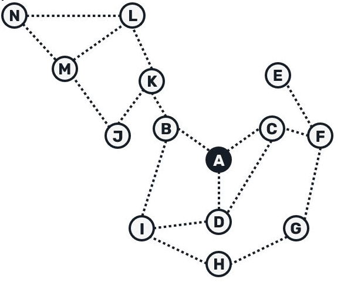

# **The Gossip Service: A Key Component of the Solana Network**

The Gossip Service acts as the **entry point** for nodes in the Solana cluster. Validators use this service to ensure that critical information, such as votes and updates, is reliably transmitted across the network. This communication is powered by the **Gossip Protocol**, a robust method for sharing data in distributed systems.

Although Solana didn’t invent the Gossip Protocol, it significantly adapted and enhanced it to meet the needs of its high-performance blockchain. To fully understand Solana’s implementation, we must first explore the origins of the Gossip Protocol and how it works.

---

## **Origins of the Gossip Protocol**

The Gossip Protocol originates from **Epidemic Broadcast Trees**, a concept designed for efficient information sharing in peer-to-peer systems. Developed at the Department of Informatics in Lisboa, Portugal, this method aimed to:

- Ensure reliable updates across all nodes.
- Minimize redundant data transmission, optimizing the network.

One specific refinement of this protocol is the **Plumtree Algorithm**, which has inspired Solana's implementation.

---

### **[Plumtree Algorithm: Building on Gossip](#plumtree-algorithm)**

The **Plumtree Algorithm** is a hybrid gossip approach that optimizes data sharing through two key techniques:

1. **Push (Active Set Communication)**: Nodes send full messages to a selected group of peers called the **active set**, while sending only a hash to others.
2. **Pull (Recovery from Missing Data)**: If a node doesn’t receive the full message, it requests the missing data using the hash. This guarantees all nodes eventually receive the complete message.
3. **Pruning Redundancy**: When a node receives duplicate messages, it sends a **prune message** to stop unnecessary transmissions.

This combination creates an efficient tree-like structure for data propagation.

### **Diagram: Plumtree Algorithm**

> **Source:** [Plumtree by Bartosz Sypytkowski](https://www.bartoszsypytkowski.com/plumtree/)

---

### **How Gossip Works in Practice: A Simulation**

Below is a GIF demonstrating a **gossip protocol** with a **fanout of 9**, the same configuration used by Solana. The simulation shows how a message propagates across **50 nodes** in just **3 hops**.

![[imgs/gossip simulation.gif]]

> **Source:** Simulation from [Gossip Simulator by Luis F. Lopez](https://flopezluis.github.io/gossip-simulator/)

Key observations from this simulation:

- A **fanout of 9** ensures each node communicates with 9 others.
- For Solana’s **2000-node cluster**, this approach achieves convergence in approximately **3.5 hops**.
- Solana further optimizes propagation by **stake-weighting** pushes, prioritizing updates to nodes with higher stakes. While low-stake nodes might take longer to receive updates, the system guarantees full synchronization within **~30 seconds**.

---

## **How Solana Improves on Plumtree**

Solana adapts the **Plumtree Algorithm** for a blockchain setting by introducing five message types: **Push**, **Prune**, **Pull**, **Ping**, and **Pong**.

### **Reused Plumtree Mechanisms**

- **Push Messages**: Propagate data to the node’s **active set**.
- **Prune Messages**: Eliminate redundant data when duplicate Push messages are received.
- **Pull Messages**: Request missing information to ensure consistency. These include a **Bloom filter**, so nodes respond only with data not already held.

### **New Additions for Reliability**

- **Ping Messages**: Periodically check if peers are active.
- **Pong Messages**: Respond to Pings to confirm liveness. Nodes that fail to respond are considered inactive and excluded from future messages.

### **Why It Matters**

These enhancements improve consistency, reduce redundancy, and ensure network reliability, even in the presence of adversarial nodes.

---

## **[Gossip Data: Types and Importance](#gossip-data-types-and-importance)**

The Gossip Protocol revolves around two critical types of data:

1. **Contact Info**:
   - Contains details about a node’s communication endpoints, such as ports for voting, block propagation, and RPC.
   - Serves as the foundation for discovering and interacting with other nodes.
2. **Votes**:
   - Represent validators' confirmations of block validity.
   - These are essential for Solana’s consensus mechanism, ensuring the integrity of the blockchain.

---

## **[Gossip Service Workflow and Threads](#gossip-service-workflow-and-threads)**

To handle the flow of messages, Solana’s Gossip Service employs a multi-threaded architecture:

### **How Gossip Works Step-by-Step**

1. **Receiving Messages**:
   - The **UDP Receiver (t_receiver)** listens for incoming messages and batches them for processing.
2. **Sorting Messages**:
   - The **Packet Processor (t_socket_consume)** deserializes these batches into protocol messages for further handling.
3. **Processing Messages**:
   - The **Protocol Handler (t_listen)** verifies and processes the messages, forwarding valid data or responding to requests.
4. **Sharing Updates**:
   - The **Gossip Thread (t_gossip)** periodically queries random nodes for updates to maintain synchronization.
5. **Sending Responses**:
   - The **UDP Responder (t_responder)** efficiently sends outgoing messages in batches.

### **Diagram: Gossip Service Workflow**

![[imgs/Gossip Service.png]]

This diagram illustrates how these threads work together to ensure seamless communication across the network.

---

## **[Protocol Messages in Gossip](#protocol-messages-in-gossip)**

Each message in Solana’s Gossip Protocol has a specific role in keeping the network synchronized:

1. **Pull Request**: "What data am I missing?"
2. **Pull Response**: "Here’s the data you’re missing."
3. **Push Message**: "Here’s new data I have."
4. **Prune Message**: "Stop sending me updates for these nodes."
5. **Ping**: "Are you still active?"
6. **Pong**: "Yes, I’m here!"

![[overview/imgs/Protocol.png]]

These messages are serialized into small binary packets and transmitted efficiently across the network.

---

### **Why This Matters**

The Gossip Protocol is essential for Solana’s success because it:

- **Synchronizes Nodes**: Ensures all participants have up-to-date information.
- **Reduces Overhead**: Optimizes communication, even in a large network.
- **Maintains Network Health**: Continuously checks node activity and connectivity.

Without this foundation, Solana’s distributed system couldn’t sustain its high performance or reliability.

---

## **Conclusion**

By building on proven concepts like the Plumtree algorithm and introducing practical enhancements, Solana has developed a robust and scalable Gossip Protocol that underpins its high-speed blockchain. This carefully crafted system ensures that validators and other network participants can work seamlessly, even at massive scales.

---

## **References**

1. [Epidemic Broadcast Trees Research Paper](https://www.dpss.inesc-id.pt/~ler/reports/srds07.pdf)
2. [Plumtree by Bartosz Sypytkowski](https://www.bartoszsypytkowski.com/plumtree/)
3. [Syndica Blog: SIG and Gossip Protocol](https://blog.syndica.io/introducing-sig-by-syndica-an-rps-focused-solana-validator-client-written-in-zig/#sigs-first-component-gossip-protocol)
4. [System Design: Bloom Filters Explained](https://systemdesign.one/bloom-filters-explained/)
5. [Solana Gossip Protocol Video](https://www.youtube.com/watch?v=Q8jwcTr7VXI&ab_channel=Solana)
6. [Gossip Simulator](https://flopezluis.github.io/gossip-simulator/)
7. [Solana Spec: Gossip Protocol](https://github.com/eigerco/solana-spec/blob/main/gossip-protocol-spec.md)
8. [Protocol Messages Implementation](https://github.com/anza-xyz/agave/blob/d131c2b92b799738a4067e426c9f558ea4cbf41f/gossip/src/protocol.rs#L53)
